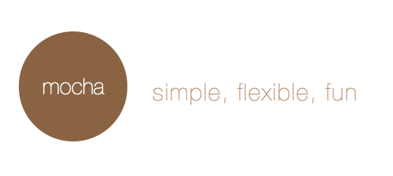

# 前端工程简介

---

## 持续集成流程

前端开发转移到后端环境，意味着可以适用标准的软件工程流程。

1. 本地开发（developing）
1. 静态代码检查（linting）
1. 单元测试（testing）
1. 合并进入主干（merging）
1. 自动构建（building）
1. 自动发布（publishing）

---

## 持续集成的概念

Continuous integration（简称 CI）：

开发代码频繁地合并进主干，始终保持可发布状态的这个过程。

优点

- 快速发现错误
- 防止分支大幅偏离主干
- 让产品可以快速迭代，同时还能保持高质量

---

## ESLint：静态代码检查工具

- 发现语法错误
- 发现风格错误
- 自动纠正错误

---

## 课堂练习：ESLint 的用法

进入`demos/eslint-demo`目录，按照[《操作指南》](#docs/practice#ESlint)，完成练习。

---

## 为什么写测试？

Web 应用越来越复杂，意味着更可能出错。测试是提高代码质量、降低错误的最好方法之一。

- 测试可以确保得到预期结果。
- 加快开发速度。
- 方便维护。
- 提供用法的文档。

对于长期维护的项目，测试可以减少投入时间，减轻维护难度。

---

## 测试的类型

- 单元测试（unit testing）
- 功能测试（feature testing）
- 集成测试（integration testing）
- 端对端测试 (End-to-End testing）

---

## 以测试为导向的开发模式

- TDD：测试驱动的开发（Test-Driven Development）
- BDD：行为驱动的开发（Behavior-Driven Development）

它们都要求先写测试，再写代码。

思考题：测试导向的开发模式有明显的优点，为什么现实生活中采用的人不多？

---

## TDD vs. BDD

两者侧重点不一样

- TDD：基于开发者角度，重点测试函数的输入输出
- BDD：基于使用者角度，重点测试对用户行为的反应

比如，有一个计数器函数`counter`，TDD 测试的是输入1，输出的应该是2；BDD 测试的是用户访问以后，计数器应该增加一次。

---

## Mocha

Mocha 是目前最常用的测试框架。

---

## 课堂练习：Mocha 的用法

进入`demos/mocha-demo`目录，按照[《操作指南》](#docs/practice#Mocha)，练习写单元测试。

---

## 功能测试

功能测试指的是，站在外部用户的角度，测试软件的某项功能。

与内部代码实现无关，只测试功能是否正常。

很多时候，单元测试都可以通过，但是整体功能会失败。

---

## 前端的功能测试

功能测试必须在真正浏览器做，现在有四种方法。

- 使用本机安装的浏览器
- 使用 Selenium Driver
- 使用 PhantomJS
- 使用 Electron

---

## Nightmare

- 使用 Electron 模拟真实浏览器环境
- 提供大量人性化、易用的 API
- 官网：[nightmarejs.org](http://www.nightmarejs.org/)

---

## 示例：Nightmare

打开`demos/nightmare-demo/`，按照[《操作说明》](../demos/README.md#nightmare)，完成操作。

---

## 移动平台的自动化测试

目前，最常见的方案是使用 Appium。

- 基于 WebDriver
- 采用 客户端/服务器架构
- 可以在模拟器运行，也可以在真机运行

---

## Appium 测试流程

1. WebDriver 客户端发出测试请求和测试内容
1. Appium 服务器转发到相应的测试运行器（Driver）
1. iOS 设备是 UIAutomation，安卓设备是 UiAutomator
1. 测试运行器将运行结果，返回给 Appium

---

## 持续集成服务平台

代码合并进主干以后，就可以进行自动构建和发布了。

网上有很多 PaaS 平台，提供持续集成服务。

Travis CI 就是其中最著名的一个，它可以根据你提供的脚本，自动完成构建和发布。

---

## 课堂练习：Travis CI

按照[《操作说明》](../demos/README.md#travis-ci)，完成练习。
